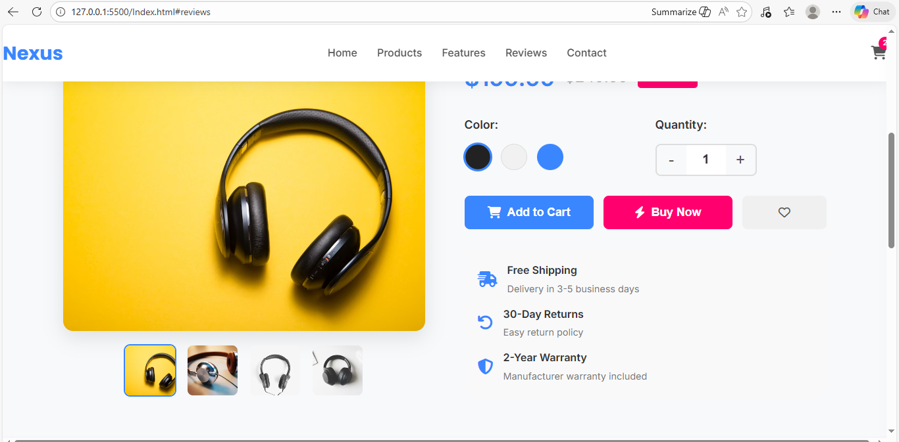
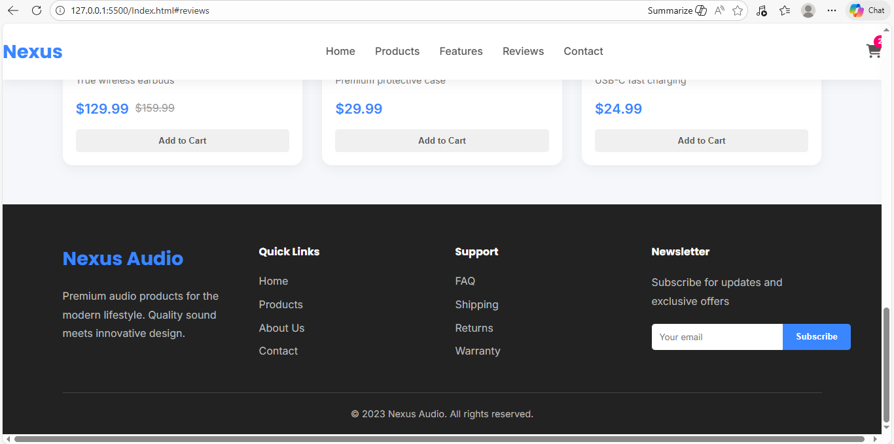

 E-commerce Product Page with Shopping Cart

A modern, responsive e-commerce product page with fully functional shopping cart built with HTML, CSS, and JavaScript.

Live Demo
(https://wilfred123816.github.io/e-commerce-website/)

Features
-Product Gallery-with thumbnail navigation
-Interactive Shopping Cart-with real-time updates
-Dynamic Quantity Control-with increment/decrement buttons
-Color Selection-options
-LocalStorage Persistence-cart saves between sessions
-Responsive Design-for all devices
-Toast Notifications-for user feedback
-Related Products-section

Technologies Used
-HTML5-Semantic markup
-CSS3-Flexbox, Grid, animations, responsive design
-JavaScript (ES6+)-Cart logic, DOM manipulation, localStorage
-Font Awesome-Icons
-Google Fonts-Typography

 Key Learnings
- State management with JavaScript
- LocalStorage for data persistence
- Dynamic DOM manipulation
- Event delegation patterns
- Responsive e-commerce UI design
- Form validation and user feedback

Screenshots
Desktop View:
Mobile View: (images/screenshot-mobile.png)

Installation & Setup
1. Clone the repository:
```bash
git clone https://github.com/wilfredmonyenye/e-commerce-website.git

2. Navigate to project directory:

bash
cd e-commerce-website

3. Open index.html in your browser
